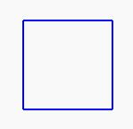

# Exercice 1 

En utilisant les commandes fournies par la bibliothèque `drawing.h`, tracer un carré.

@[Exercice 1]({"stubs": ["main.c"],"command": "sh /project/target/run.sh", "project" : "drawing"})